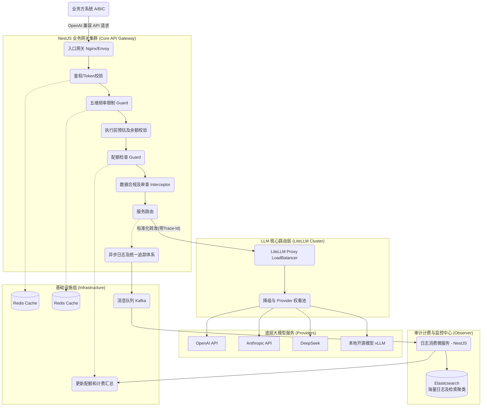

# 企业级 LLM 网关架构设计文档 (LLM Gateway Architecture Design)

## 1. 架构总览与设计理念 (Architecture Overview & Philosophy)

本项目的目标是为公司内部多个项目组提供一个统一、安全、高可用且易于追踪的 **生产级 LLM 网关 (LLM Gateway)**。

作为一个中台化服务，网关的核心设计理念包括：

1. **统一出口与路由 (Unified Routing)**：屏蔽底层大模型提供商（OpenAI, Anthropic, 阿里云通义千问, 智谱等）的差异，统一采用 OpenAI 兼容格式对外提供服务。
2. **多租户隔离与管控 (Multi-Tenancy & Quota)**：支持按项目组、按应用分发 API Key，并进行独立的速率限制 (Rate Limiting) 和计费/配额管理 (Quota/Billing)。
3. **高可用与容灾 (High Availability & Fallback)**：提供智能路由、自动重试、失败降级 (Fallback) 以及负载均衡，确保生产环境的稳定性。
4. **全面的可观测性 (Observability)**：所有 Prompt、Response、Token 消耗及延迟必须有完整的审计日志。
5. **极简接入，微服务架构部署**：使得各业务方可以零成本接入（直接替换 Base URL 和 Key 即可）。

---

## 2. 核心技术栈及选型理由 (Core Technology Stack & Rationale)

| 组件                  | 技术选型                                          | 选型理由 (Rationale)                                                                                                                                                                                                                                 |
| --------------------- | ------------------------------------------------- | ---------------------------------------------------------------------------------------------------------------------------------------------------------------------------------------------------------------------------------------------------- |
| **底层核心框架**      | **NestJS (Node.js/TypeScript)**                   | NestJS 提供开箱即用的模块化设计、依赖注入、中间件、守卫(Guard)和拦截器，非常适合构建可维护的企业级微服务架构。Node.js 的非阻塞 I/O 在处理大量流式 (Streaming) 网络请求时性能表现优异。                                                               |
| **LLM 适配层**        | **LiteLLM (Python proxy) 或直接基于 Node 端封装** | 用户指定了 LiteLLM。LiteLLM 是目前最佳的开源 LLM 代理，内置了一百多个模型的标准化适配（OpenAI 格式）、重试、负载均衡和 Fallback 能力。**架构建议：NestJS 作为前置的业务网关处理鉴权/计费/审计，后端挂载 LiteLLM Proxy 容器集群处理模型转换和请求。** |
| **关系型数据库**      | **PostgreSQL (配合 Prisma ORM)**                  | 存储租户信息、应用管理、API Key 和配额流水。PostgreSQL 在处理高并发、复杂查询及 JSONB 扩展上表现极佳，Prisma 提供了极佳的 TypeScript 类型安全。                                                                                                      |
| **缓存与实时计数**    | **Redis (Cluster)**                               | 用于实现高速的多维速率限制 (Rate Limiting 2.0)、分布式锁以及频繁读取的缓存（实时余额校验、Key 的校验、路由规则等），极大地降低对数据库的压力。                                                                                                       |
| **消息队列 (必选)**   | **Kafka / RabbitMQ**                              | 必须引入消息队列处理异步日志落盘。考虑到 LLM 吞吐量大，首选 Kafka，以 `projectId` 作为 partition key 保证顺序消费不死锁。通过 MQ 将日志和账单异步写入存储系统，并增加 Dead Letter Queue 异常处理机制。                                               |
| **历史/审计日志存储** | **Elasticsearch**                                 | 专门用于存储海量的调用日志 (请求体、响应体、耗时、Token 消耗等)，利用 ES 强大的全文检索与聚合分析能力，以便给各业务线生成对账单及监控仪表盘。                                                                                                        |
| **网关/反向代理**     | **Nginx 或 Envoy**                                | 作为整个集群的统一入口点，处理 SSL 证书卸载、基础的连接数限制和向 NestJS 微服务集群的负载均衡。                                                                                                                                                      |

---

## 3. 微服务架构设计分解 (Microservices Decomposition)

鉴于将提供给公司多个组使用，我们采用**松耦合的微服务/模块化(Monorepo)架构**。

### 3.1 业务架构图



### 3.2 核心服务模块职责

可以基于 NestJS Microservices (TCP 或 Redis 传输) 构建，或者在初期通过单一 Monorepo 拆分模块，之后再通过 Kubernetes 水平扩展：

1. **GateWay Service (核心前置网关)**：接受业务方 HTTP 请求，进行身份验证，鉴别 API Key，速率控制，后将请求转发给内部的 LiteLLM 集群。它还要负责拦截响应，统计 Token 并在后台发出日志事件。
2. **Admin Service (管理后台服务)**：面向公司运维、项目经理，用于创建租户、分配额度、查看统计表、管理底层各模型渠道的 API Key 和路由规则配置。
3. **Log & Billing Consumer (异步计费与日志消费者)**：从消息队列获取调用明细，异步更新 PG 中的账户余额，并将详细请求体落入 Elasticsearch 中用于检索和统计。
4. **LiteLLM Proxy (模型代理引擎)**：纯粹的转发与转化引擎。通过 Docker 独立部署，利用其自带的能力将各种 Provider 转化为统一 OpenAI 格式，处理 Retry 和轮询。

---

## 4. 关键数据流转设计 (System Data Flow)

### 场景：业务线 A 发起一次流式 (Streaming) Chat Completions 请求

1. **接入层**：业务应用 A 使用分配到的 `sk-gateway-xxxx`，像请求 OpenAI 一样请求该网关 `https://llm.company.com/v1/chat/completions`。
2. **网关层 (NestJS)**：
   - 提取 Header 中的 `Authorization: Bearer sk-gateway-xxxx`，并注入全链路 `Trace-Id` (OpenTelemetry 集成基础)。
   - **(并发与熔断)** 限制单节点最大并发数，并在网关层引入**独立 Circuit Breaker (熔断器)**。如果发现 LiteLLM Proxy 严重阻塞延迟，立刻掐断，保护 Node.js 事件循环不被拖死。
   - **(Cache Hit)** 查 Redis 校验 Key 是否合法（同时验证 Key 的版本号以支持强制失效）。
   - **(Rate Limit 2.0)** Redis 配合 Lua 脚本执行防并发防刷限流（五维保护）。其中并发限制必须精细绑定到 Streaming 生命周期中释放。
   - **(Cost Estimator & Pre-deduct)** 执行前依据预估模型费率**进行余额“预扣冻结”**，防止流式打满后欠费。
   - **(安全与合规 DLP)** 执行异步可降级 (Degradable) 的轻量规则引擎 DLP 扫描（绝不在主链路二次调用大模型做 DLP），挂掉时不能阻拦正常业务。
3. **路由代理层**：
   - 生成追踪 ID (`Trace-Id`)注入 Header 集群追踪。
   - 网关将请求动态转发到内部 `http://litellm-cluster:4000/chat/completions`。
4. **模型执行层 (LiteLLM)**：
   - LiteLLM 开启配置 `stream_options: { include_usage: true }`，强制底座大模型（即使在流式情境下）一并返回 Token Usage。
   - 利用内置权重配置（例如 `azure_openai weight 60` / `openai weight 40`）做负载均衡。
5. **流式响应处理 (Stream Pass-through & Response Scan)**：
   - NestJS 采用流式数据透传给业务方，边收边发，确保业务方能获得打字机效果，并实施后置敏感审计（Response Scan）。
   - **(拦截与统计)** 废弃对 CPU 消耗大的 Node.js 级 token 计算，全盘信任并直接提取上游 Provider 的 `usage` 做最终计费标尺（包含异常断流补全逻辑或 fallback 估算）。
6. **异步结算与一致性保障**：网关向 Kafka 投递带有准确 usage 的日志消息。
   - **消费者顺序消费**：利用 `projectId` 的 Partition Key 控制有序消费且防阻塞（伴随 Dead Letter Queue）。
   - **数据库余额一致性**：账单更新逻辑强制实现幂等。在 PostgreSQL 端必须采用**事务 + 行级锁 (`SELECT ... FOR UPDATE`)** 执行“最终扣准与补差释放”，彻底杜绝并发超卖的坑。每天定时执行 Reconciliation（对账）对齐 Provider 偏差。

---

## 5. 高可用与安全设计体系 (HA & Security)

### 5.1 安全机制

- **API Key 脱敏与轮转**：底层的真实大模型 Key 绝不暴露，并由网关配合 LiteLLM 做统一配置与轮转。泄露公司级 Key 的风险被隔离。
- **内网零信任与最小权限**：LiteLLM 集群不仅不开放外网，也不允许访问如 PG, Redis 等核心数仓。配合 Kubernetes NetworkPolicy 以及 Service-to-Service mTLS 证书加固内部流转。
- **DLP 全链路审计**：NestJS 中间件分为 Request Scan 与 Response Scan。**DLP 必须采用本地轻量规则引擎或正则，绝不用大模型进行二次耗时判定；且扫描必须异步可降级，故障时不能阻断主流量。**

### 5.2 流量管控机制

- **预扣与最终结算补差机制**：执行层结合 `Pre-Execution Cost Estimator`。执行前查表粗估并预扣（冻结）Token 费，流式彻底结束后根据实际用量“多退少补”。从根本上完美防止流式大请求突破余额上限导致的负产值。
- **五维限流 (Rate Limiting 2.0)**：废除单纯递增拦截，拥抱 Redis & Lua 原子 Token Bucket 控制。特别注意：**TPM 必须采用滑动窗口 + 分段桶算法避免边界突刺，所有缓存必须有 TTL 防脏数据长期存在。**

### 5.3 模型高可用 (LiteLLM特性加持)

- **强制 Timeout 防悬挂与断路器**：任何向下游 Provider 的模型请求，**均需配置强制 timeout 与 retry 上限**。系统层面引入全局断路器，防止下游堵塞打爆网关。
- **基于权重的 Provider 模型路由池**：不再是单一后备路线。通过设定权重 (Weighted Routing)，将同一模型的调用分配到比如 Azure (60%) 与 OpenAI (40%) 之上保障可用率并分流计税限额。同时必须为**每个 provider 附加独立 QPS 上限阈值防护单点雪崩。**

---

## 6. 环境部署拓扑与运维底座 (Deployment Topology & DevOps)

采用 **Kubernetes (K8s) + Helm** 构建，因为微服务扩展性极强。强烈要求遵守以下底线要求：

- **业务网关 Pods (NestJS)**：配置 HPA (基于 CPU + RPS 双指标扩缩容) 以及 PDB (PodDisruptionBudget)。
- **模型代理 Pods (LiteLLM Proxy)**：**必须配置内部 `readinessProbe`**，防止自身未加载完路由策略即拉入流量池。强化硬 limit 以防 OOM 影响全节点。
- **审计日志存储策略 (Elasticsearch)**：**必须设置 ILM (Index Lifecycle Management) 并搭建冷热分层**。默认千万不要全量存原始 prompt 原文（脱敏处理后存入核心维度表，高频字段转日快照表），防止几个月内 ES 费用失控。
- **数据库/缓存中间件**：
  - **PG** 运行一主一从 (Master/Slave)。
  - **Redis** 运行 Sentinel 集群，保证高可用。
  - **日志/ MQ** 可以采用云原生托管服务以降低运维门槛（如 AWS MSK/Elasticache）。

---

## 7. 推荐项目目录结构 (pnpm workspace)

强烈建议结合 pnpm workspace 模式来更灵活地管理多包依赖：

```
llm-gateway-platform/
├── apps/
│   ├── api-gateway/            # 核心网关服务
│   │   ├── src/
│   │   │   ├── proxy/          # 转发给 LiteLLM 的逻辑
│   │   │   ├── guards/         # AuthGuard, QuotaGuard, RateLimitGuard
│   │   │   ├── interceptors/   # 流式数据拦截与 Token 统计
│   │   │   └── api-gateway.module.ts
│   ├── admin-api/              # 给管理后台用的 REST API
│   │   └── src/
│   │       ├── users/
│   │       ├── api-keys/
│   │       ├── billings/
│   │       └── admin-api.module.ts
│   └── background-worker/      # 离线统计与日志消费者
│       ├── src/
│       │   ├── rmq-consumer/
│       │   ├── sync-tasks/     # 每日出帐对账定时任务
│       │   └── worker.module.ts
├── libs/
│   ├── database/               # Prisma schema 与抽象类库
│   ├── redis/                  # Redis 公共缓存与分布式锁机制库
│   └── shared-types/           # DTO, Enums 等复用定义段
├── deploy/
│   ├── docker-compose.yml      # 用于本地快速拉起 Postgres + Redis + LiteLLM 调试
│   ├── k8s/
│   └── litellm-config.yaml     # LiteLLM 路由转发规则管理文件
├── package.json
└── nest-cli.json
```

---

## 8. 下阶段演进建议

作为 CTO 的架构演进路线图整合：

### 阶段 1 (MVP)

- 统一路由入口，JWT/API Key 鉴权。
- LiteLLM 基础接入。
- 基础滑动窗口限流。
- **架构增强融合：**强制 usage 统一返回，取消 Node 端 CPU 型 token 计算；搭建 Kafka 并行投递异步日志和结算。

### 阶段 2 (生产级增强)

- **架构增强融合：**实现 Redis + Lua 五维 Rate Limiting 2.0。
- **架构增强融合：**Kafka 以 `projectId` 设定分区键保障一致性，加入 Dead Letter Queue。
- **架构增强融合：**加入预执行成本预测 (Pre-Execution Cost Estimator) 和实时余额日账单体系。
- **架构增强融合：**接入 DLP 请求及返回的扫描体系 (PII/Prompt Injection)。
- **架构增强融合：**配置 LiteLLM 上的 Provider 权重参数，做到负载池优化。

### 阶段 3 (企业 AI 中台治理)

- 引入 **Agent/Smart Router (智能模型路由)**，根据 Prompt 长度或业务性质自动化分配高阶或平价模型通道。
- 建立基于 `Average Latency` 及错误率的**模型健康评分机制**主动更新路由表。
- 成立独立的 **Prompt Service** 管理中心把控模板与 AB 测试注入。
- 健全基于 OpenTelemetry/Jaeger 的 **统一追踪体系 (Tracing)** 及 mTLS 内网零信任网络墙。
