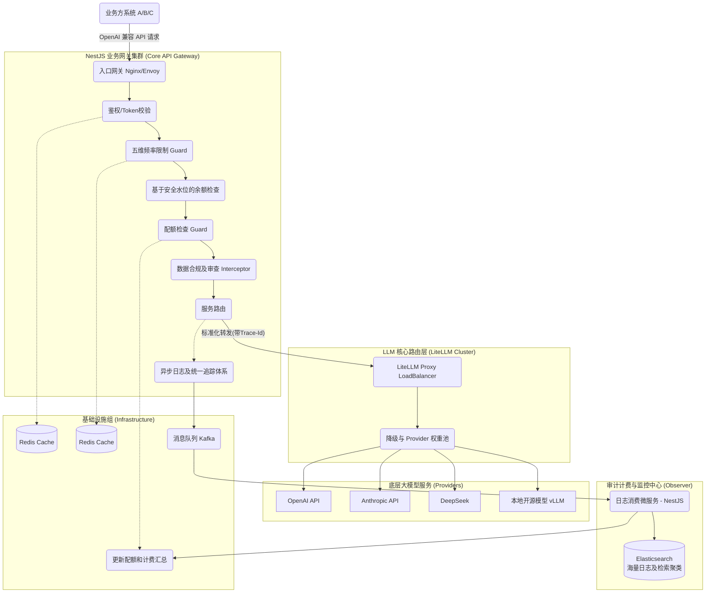
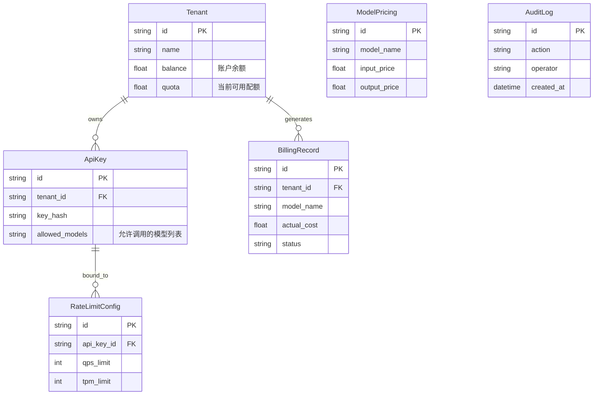
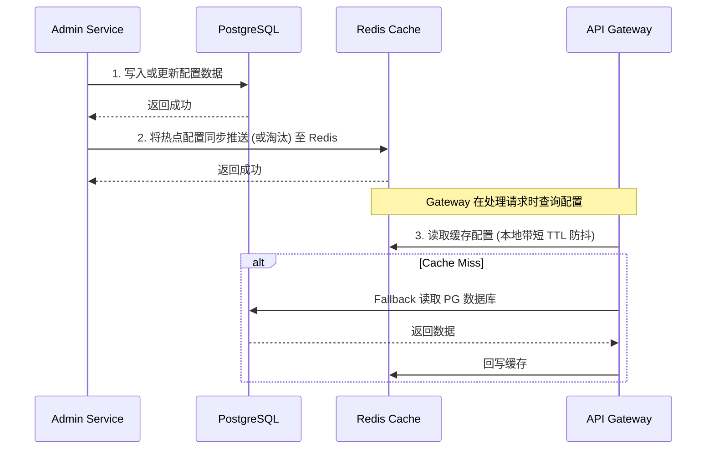

# 企业级 LLM 网关架构设计文档 (LLM Gateway Architecture Design)

## 1. 架构总览与设计理念 (Architecture Overview & Philosophy)

本项目的目标是为公司内部多个项目组提供一个统一、安全、高可用且易于追踪的 **生产级 LLM 网关 (LLM Gateway)**。

作为一个中台化服务，网关的核心设计理念包括：

1. **统一出口与路由 (Unified Routing)**：屏蔽底层大模型提供商（OpenAI, Anthropic, 阿里云通义千问, 智谱等）的差异，统一采用 OpenAI 兼容格式对外提供服务。
2. **多租户隔离与管控 (Multi-Tenancy & Quota)**：支持按项目组、按应用分发 API Key，并进行独立的速率限制 (Rate Limiting) 和计费/配额管理 (Quota/Billing)。
3. **高可用与容灾 (High Availability & Fallback)**：提供智能路由、自动重试、失败降级 (Fallback) 以及负载均衡，确保生产环境的稳定性。
4. **全面的可观测性 (Observability)**：所有 Prompt、Response、Token 消耗及延迟必须有完整的审计日志。
5. **极简接入，微服务架构部署**：使得各业务方可以零成本接入（直接替换 Base URL 和 Key 即可）。

---

## 2. 核心技术栈及选型理由 (Core Technology Stack & Rationale)

| 组件                  | 技术选型                                          | 选型理由 (Rationale)                                                                                                                                                                                                                                        |
| --------------------- | ------------------------------------------------- | ----------------------------------------------------------------------------------------------------------------------------------------------------------------------------------------------------------------------------------------------------------- |
| **底层核心框架**      | **NestJS (Node.js/TypeScript)**                   | NestJS 提供开箱即用的模块化设计、依赖注入、中间件、守卫(Guard)和拦截器，非常适合构建可维护的企业级微服务架构。Node.js 的非阻塞 I/O 在处理大量流式 (Streaming) 网络请求时性能表现优异。                                                                      |
| **LLM 适配层**        | **LiteLLM (Python proxy) 或直接基于 Node 端封装** | 用户指定了 LiteLLM。LiteLLM 是目前最佳的开源 LLM 代理，内置了一百多个模型的标准化适配（OpenAI 格式）、重试、负载均衡和 Fallback 能力。**架构建议：NestJS 作为前置的业务网关处理鉴权/计费/审计，后端挂载 LiteLLM Proxy 容器集群处理模型转换和请求。**        |
| **关系型数据库**      | **PostgreSQL (配合 Prisma ORM)**                  | 存储租户信息、应用管理、API Key 和配额流水。PostgreSQL 在处理高并发、复杂查询及 JSONB 扩展上表现极佳，Prisma 提供了极佳的 TypeScript 类型安全。                                                                                                             |
| **缓存与实时计数**    | **Redis (Standalone/Cluster)**                    | 初创与本地开发使用 Standalone，生产环境使用 Cluster。用于实现高速的多维速率限制 (Rate Limiting 2.0)、分布式锁以及频繁读取的缓存（实时余额校验、Key 的校验、路由规则等），极大地降低对数据库的压力。                                                     |
| **消息队列 (必选)**   | **Kafka / RabbitMQ**                              | 必须引入消息队列处理异步日志落盘。考虑到 LLM 吞吐量大，首选 Kafka。**避免使用单一 `projectId` 导致热点分区**，应使用 `hash(projectId + traceId)` 作为 Partition Key 打散流量。通过 MQ 将日志和账单异步写入存储系统，并增加 Dead Letter Queue 异常处理机制。 |
| **历史/审计日志存储** | **Elasticsearch**                                 | 专门用于存储海量的调用日志 (请求体、响应体、耗时、Token 消耗等)，利用 ES 强大的全文检索与聚合分析能力，以便给各业务线生成对账单及监控仪表盘。                                                                                                               |
| **网关/反向代理**     | **Nginx 或 Envoy**                                | 作为整个集群的统一入口点，处理 SSL 证书卸载、基础的连接数限制和向 NestJS 微服务集群的负载均衡。                                                                                                                                                             |

---

## 3. 微服务架构设计分解 (Microservices Decomposition)

鉴于将提供给公司多个组使用，我们采用**松耦合的微服务/模块化(Monorepo)架构**。

### 3.1 业务架构图



### 3.2 核心服务模块职责

可以基于 NestJS Microservices (TCP 或 Redis 传输) 构建，或者在初期通过单一 Monorepo 拆分模块，之后再通过 Kubernetes 水平扩展：

1. **GateWay Service (核心前置网关)**：接受业务方 HTTP 请求，进行身份验证，鉴别 API Key，速率控制，后将请求转发给内部的 LiteLLM 集群。它还要负责拦截响应，统计 Token 并在后台发出日志事件。
2. **Admin Service (管理后台服务)**：面向公司运维、项目经理，用于创建租户、分配额度、查看统计表、管理底层各模型渠道的 API Key 和路由规则配置。
3. **Log & Billing Consumer (异步计费与日志消费者)**：从消息队列获取调用明细，异步更新 PG 中的账户余额，并将详细请求体落入 Elasticsearch 中用于检索和统计。
4. **LiteLLM Proxy (模型代理引擎)**：纯粹的转发与转化引擎。通过 Docker 独立部署，利用其自带的能力将各种 Provider 转化为统一 OpenAI 格式，处理 Retry 和轮询。

### 3.3 核心数据模型 (ER Diagram)

为了支撑配额管控与审计需求，底层数据库 Schema 设计如下：



---

### 4.2 动态配置同步机制 (Dynamic Configuration Sync)

管理员在 Admin Service 修改路由、权限或计费等配置时，更新流程如下：



---

## 5. 关键数据流转设计 (System Data Flow)

### 场景：业务线 A 发起一次流式 (Streaming) Chat Completions 请求

1. **接入层**：业务应用 A 使用分配到的 `sk-gateway-xxxx`，像请求 OpenAI 一样请求该网关 `https://llm.company.com/v1/chat/completions`。要求 Nginx/Envoy 到 NestJS 配置开启长连接复用，且 NestJS 必须配置 `app.set('trust proxy', true)`，确保从 `X-Forwarded-For` 获取客户端真实 IP，防止使用代理 IP 进行限流时导致全站防刷误封。
2. **网关层 (NestJS)**：
   - 提取 Header 中的 `Authorization: Bearer sk-gateway-xxxx`，并注入全链路 `Trace-Id` (OpenTelemetry 集成基础)。
   - **(并发与熔断)** 限制单节点最大并发数，并在网关层引入**独立 Circuit Breaker (熔断器)**。如果发现 LiteLLM Proxy 严重阻塞延迟，立刻掐断，保护 Node.js 事件循环不被拖死。
   - **(Cache Hit)** 查 Redis 校验 Key 是否合法（同时验证 Key 的版本号以支持强制失效）。
   - **(Rate Limit 2.0)** Redis 配合 Lua 脚本执行防并发防刷限流（五维保护）。其中并发限制必须精细绑定到 Streaming 生命周期中释放。
   - **(Balance Watermark Check)** 放弃精准“预扣冻结”。网关层仅做轻量的**并发数限制**和**Token余额水位检查**，只要余额大于安全阈值即可放行，避免大模型 `max_tokens` 引发无辜额度被大面积冻结。
   - **(安全与合规 DLP)** 执行异步可降级 (Degradable) 的轻量规则引擎 DLP 扫描（绝不在主链路二次调用大模型做 DLP），挂掉时不能阻拦正常业务。
3. **路由代理层**：
   - 生成追踪 ID (`Trace-Id`)注入 Header 集群追踪。
   - 网关将请求动态转发到内部 `http://litellm-cluster:4000/chat/completions`。此处 HttpModule 或原生代理**必须配置 keep-alive 连接池**（如 `agentkeepalive`）以复用 TCP 连接，避免高并发下本地端口耗尽。
4. **模型执行层 (LiteLLM)**：
   - LiteLLM 开启配置 `stream_options: { include_usage: true }`，强制底座大模型（即使在流式情境下）一并返回 Token Usage。
   - 利用内置权重配置（例如 `azure_openai weight 60` / `openai weight 40`）做负载均衡。
5. **流式响应处理与流式安全网机制 (Stream Pass-through & Security Guard)**：
   - NestJS **绕过沉重的拦截器/序列化机制**，直接获取原生的 Node `req` 和 `res` 对象，使用 `stream.pipe()` 等轻量化方式进行字节流透传，边收边发，确保打字机效果的同时避免大规模并发下的内存溢出(OOM)。实施异步且不阻塞的后置敏感审计（Response Scan）。
   - **(流式安全限制与取消信号)**：必须为 `stream` 配置高水位线限流（`highWaterMark` 控制回压），设置防悬挂的最大空闲超时（`idle timeout`），以及总体最大字节数拦截（`max body size`）。**极为关键的是**，必须监听客户端断开事件（如 `req.on('close')`），一旦由于网络断开或用户关闭侧边栏导致请求终止，网关需**立即触发 `AbortController` 向上游（LiteLLM和底座模型）发送取消信号**，阻止大量无意义生成产生的成本浪费。
   - **(拦截与统计)** 废弃对 CPU 消耗大的 Node.js 级 token 计算，全盘信任并直接提取上游 Provider 的 `usage` 做最终计费标尺。**如果遇到异常断流（未能收到 `usage` 块），则降级使用 `js-tiktoken` 对已接收文本执行保守估算，乘以 1.2x 上浮系数，将账单标记为 `status: ESTIMATED` 待每日人工/脚本对账修正**。
6. **异步结算与最终一致性保障**：网关向 Kafka 投递带有准确 usage 的日志消息。
   - **防热点打散消费**：利用 `hash(projectId + traceId)` 的 Partition Key 将请求均匀打散，解决单一项目组流量过大导致的 Kafka 消费者过载。**此设计之所以安全**，是因为在业务逻辑中，核心计费扣减已通过 Redis Lua 原子操作准实时完成，消费者层面的 PostgreSQL Batch 落库不再强依赖同一笔 Tenant 资金的严格“顺序消费”。
   - **基于 Redis 的准实时扣费与 PG 批量刷盘**：放弃在 PostgreSQL 核心链路使用 `SELECT ... FOR UPDATE` 悲观锁。Kafka 消费者收到 `usage` 后，先利用 **Redis Lua 脚本** 进行高性能的余额原子扣减。消费者或后台定时任务再异步将增量 **Batch Update** 持久化到 PostgreSQL 中。彻底杜绝数据库连接池耗尽。
   - **数据对账与最终一致性源 (Reconciliation)**：以 Kafka 投递的日志与实际上游账单为最终数据源 (Source of Truth)，**Redis 的余额仅作为“软控阈值”**。若发生 Redis 宕机切主等导致极少量短时数据丢失的极端情况，通过每日对账脚本自动修正 PostgreSQL 与 Redis 之间的偏差。

---

## 5. 高可用与安全设计体系 (HA & Security)

### 5.1 安全机制

- **API Key 脱敏与轮转**：底层的真实大模型 Key 绝不暴露，并由网关配合 LiteLLM 做统一配置与轮转。泄露公司级 Key 的风险被隔离。
- **内网零信任与最小权限**：LiteLLM 集群不仅不开放外网，也不允许访问如 PG, Redis 等核心数仓。配合 Kubernetes NetworkPolicy 以及 Service-to-Service mTLS 证书加固内部流转。
- **DLP 全链路审计**：NestJS 中间件分为 Request Scan 与 Response Scan。**DLP 必须采用本地轻量规则引擎或正则，绝不用大模型进行二次耗时判定；且扫描必须异步可降级，故障时不能阻断主流量。**

### 5.2 流量管控机制

- **基于安全阈值的检查与 Redis 准实时扣减**：放弃精准“预扣冻结”，只在网关做轻量化的 Token 水位阈值检查放行。Kafka 收到日志后，基于 Redis In-Memory 原子计算迅速完成准实时扣除，并批量合并落库，以最终一致性的形态实现高并发不锁表的低延迟计费。
- **五维限流 (Rate Limiting 2.0)**：废除单纯递增拦截，拥抱 Redis & Lua 原子 Token Bucket 控制。特别注意：**TPM 必须采用滑动窗口 + 分段桶算法避免边界突刺，所有缓存必须有 TTL 防脏数据长期存在。**

### 5.3 模型高可用 (LiteLLM特性加持)

- **强制 Timeout 防悬挂与断路器**：任何向下游 Provider 的模型请求，**均需配置强制 timeout 与 retry 上限**。系统层面引入全局断路器，防止下游堵塞打爆网关。
- **基于权重的 Provider 模型路由池**：不再是单一后备路线。通过设定权重 (Weighted Routing)，将同一模型的调用分配到比如 Azure (60%) 与 OpenAI (40%) 之上保障可用率并分流计税限额。同时必须为**每个 provider 附加独立 QPS 上限阈值防护单点雪崩。**
- **LiteLLM 核心代理旁路直连 (Direct Bypass)**：即便存在高可用的 Python 代理，大流量极限峰值下 LiteLLM 仍可能成为性能瓶颈（由于 GIL 的限制）。建议在业务层加上直接越过代理网关的直连后门。一旦探测到 LiteLLM 雪崩故障，NestJS 可根据后台下发的降级配置启用备用原生 Key，直连如 OpenAI/Azure 原生接口，作为保底系统维持运行。

---

## 6. 环境部署拓扑与运维底座 (Deployment Topology & DevOps)

采用 **Kubernetes (K8s) + Helm** 构建，因为微服务扩展性极强。强烈要求遵守以下底线要求：

- **业务网关 Pods (NestJS)**：配置 HPA (基于 CPU + RPS 双指标扩缩容) 以及 PDB (PodDisruptionBudget)。
- **模型代理 Pods (LiteLLM Proxy)**：受限于 Python GIL 单进程并发上限瓶颈，必须采用**高 `replicas` 横向扩容**策略而非垂直增加单 Pod CPU。**必须配置内部 `readinessProbe`**，防止自身未加载完路由策略即拉入流量池。强化硬 limit 以防 OOM 影响全节点。
- **审计日志存储策略 (Elasticsearch)**：**必须设置 ILM (Index Lifecycle Management) 并搭建冷热分层**。默认千万不要全量存原始 prompt 原文，防止 ES 费用失控。但为支持排查纠纷及客诉反馈需求，建议提供**租户级开关 (Tenant-level Config)**，允许特定测试态应用或极高权限租户开启“完整 Payload 留存 (100% Trace)”机制，开启后的原文数据保存期强制限制仅存 3-7 天。
- **数据库/缓存中间件**：
  - **PG** 运行一主一从 (Master/Slave)。
  - **Redis** 生产环境运行 Cluster 集群（保证高可用与分布式写入性能），初期与本地开发可使用 Standalone 模式。
  - **日志/ MQ** 可以采用云原生托管服务以降低运维门槛（如 AWS MSK/Elasticache）。

---

## 7. 推荐项目目录结构 (pnpm workspace)

强烈建议结合 pnpm workspace 模式来更灵活地管理多包依赖：

```
llm-gateway-platform/
├── apps/
│   ├── api-gateway/            # 核心网关服务
│   │   ├── src/
│   │   │   ├── proxy/          # 转发给 LiteLLM 的逻辑
│   │   │   ├── guards/         # AuthGuard, QuotaGuard, RateLimitGuard
│   │   │   ├── interceptors/   # 流式数据拦截与 Token 统计
│   │   │   └── api-gateway.module.ts
│   ├── admin-api/              # 给管理后台用的 REST API
│   │   └── src/
│   │       ├── users/
│   │       ├── api-keys/
│   │       ├── billings/
│   │       └── admin-api.module.ts
│   └── background-worker/      # 离线统计与日志消费者
│       ├── src/
│       │   ├── rmq-consumer/
│       │   ├── sync-tasks/     # 每日出帐对账定时任务
│       │   └── worker.module.ts
├── libs/
│   ├── database/               # Prisma schema 与抽象类库
│   ├── redis/                  # Redis 公共缓存与分布式锁机制库
│   └── shared-types/           # DTO, Enums 等复用定义段
├── deploy/
│   ├── docker-compose.yml      # 用于本地快速拉起 Postgres + Redis + LiteLLM 调试
│   ├── k8s/
│   └── litellm-config.yaml     # LiteLLM 路由转发规则管理文件
├── package.json
└── nest-cli.json
```

> 📌 **路线图与实施计划**：请参阅 [ROADMAP.md](./ROADMAP.md)，包含阶段划分、周度执行计划、优先级排序及验收标准。
